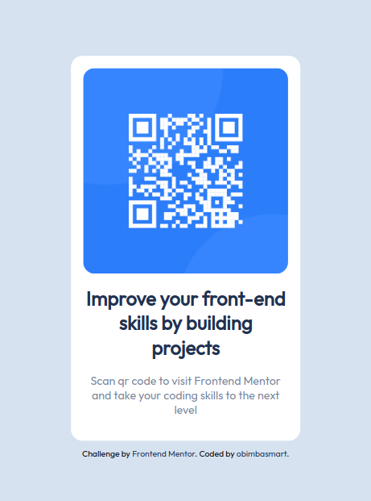

# Frontend Mentor - QR code component solution
This is a solution to the [QR code component challenge on Frontend Mentor](https://www.frontendmentor.io/challenges/qr-code-component-iux_sIO_H). Frontend Mentor challenges help you improve your coding skills by building realistic projects.

## Challenge
Build out [this](https://www.frontendmentor.io/challenges/qr-code-component-iux_sIO_H) QR code component and get it looking as close to the design as possible.
- You can use any tools you like to help you complete the challenge. So if you've got something you'd like to practice, feel free to give it a go.


## Solution

<div align="center">
  
</div>


### Links

- Live Site URL: [Not available yet](https://your-live-site-url.com)

### Built with
- HTML and CSS
- Mobile-first workflow
- CSS custom properties
- Flexbox


### Key Learning

This QR code component project served as an excellent opportunity to learn fundamental HTML and CSS properties. During its development, the greatest challenge I encountered was centering the component both vertical and horizontal on the page.

To center an html element verticall on the page, I used CSS flexbox as shown below:

```html
<body>
    <div class="container">
        <div class="content">
            <!-- Your content goes here -->
        </div>
    </div>
</body>
</html>
```

```css
body {
    display: flex;
    justify-content: center;
    align-items: center;
    height: 100vh; /* Make sure the body covers the entire viewport height */
    margin: 0;
}

.container {
    text-align: center; /* Optional: Center the content horizontally */
}

.content {
    /* Your content styles */
}
```