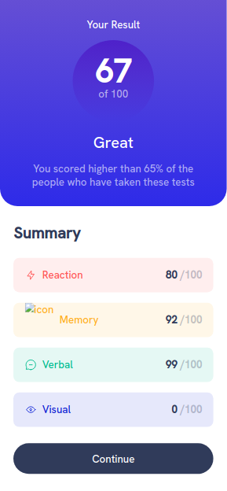

# Frontend Mentor - Results summary component solution

This is a solution to the [Results summary component challenge on Frontend Mentor](https://www.frontendmentor.io/challenges/results-summary-component-CE_K6s0maV).
## Table of contents

### The challenge

Users should be able to:

- View the optimal layout for the interface depending on their device's screen size
- See hover and focus states for all interactive elements on the page
- **Bonus**: Use the local JSON data to dynamically populate the content

## Solution

  
  

### Links

- Solution URL: [Add solution URL here](https://your-solution-url.com)
- Live Site URL: [Add live site URL here](https://your-live-site-url.com)

### Built with

- HTML, CSS and Javascript
- Flexbox
- Mobile-first workflow
- DOM manipulation
- JSON object

## What I learned

This project was truly remarkable. I harnessed the power of JSON objects to dynamically populate and enhance the web page with external data. What truly captivated me was the sheer speed and efficiency with which I could add elements to the page. Instead of the traditional approach of hard-coding information, I leveraged JavaScript to populate the page based on an array of objects. This streamlined process allowed me to effortlessly introduce new items to the page by simply adding another object to the data source, with automatic inclusion on the page. My admiration for JavaScript has grown immensely through this experience.

I eagerly anticipate exploring how frameworks like `ReactJS` accomplish similar feats and the innovative possibilities they bring to web development.

### Useful resources
- [How to build HTML using JavaScript](https://www.tutorialspoint.com/how-to-return-html-or-build-html-using-javascript#:~:text=This%20can%20be%20done%20using,or%20build%20HTML%20using%20JavaScript) - This helped me learn how to build html elements in javascript

## Author
- [Obimba Smart](https://www.github.com/obimbasmart)
