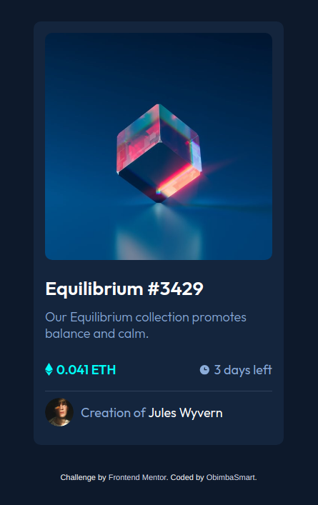

# Frontend Mentor - NFT preview card component solution

This is a solution to the [NFT preview card component challenge on Frontend Mentor](https://www.frontendmentor.io/challenges/nft-preview-card-component-SbdUL_w0U).

## The challenge

Users should be able to:

- View the optimal layout depending on their device's screen size
- See hover states for interactive elements

## Solution

        

### Links

- Solution URL: [Not Yet Available](https://your-solution-url.com)
- Live Site URL: [N/A](https://your-live-site-url.com)

### Built with

- HTML, CSS
- Semantic HTML5 markup
- Flexbox
- Mobile-first workflow

### What I learned

This project further went ahead to enforce my learning and understanding of CSS flexbox and how to center elements. What I love about this project was the right use of colors. Fun fact: it took me `1hr:30min` to complete the challenge

## Author
[Obimba Smart](https://github.com/obimbasmart/)