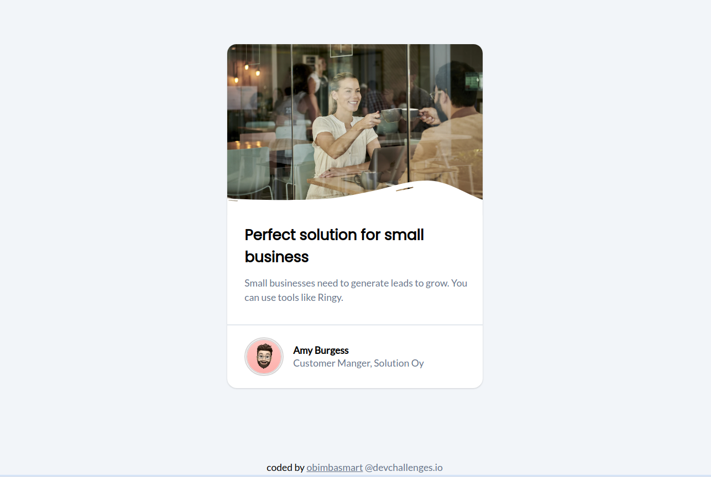

# Business Blog Card
> [@devchallenge.io]()

 This challenge was a great way to practice basic HTML and CSS skills. The challenge is to create a business blog card that challenges to use flexbox, positioning,...

`Fun Fact:` It took me an `1hr` to complete this project

### `Live solution`: [business_blog_card](https://obimbasmart.tech/business_blog_card/)

## Credit:
[devchallenge.io](https://devchallenges.io/challenge/28)