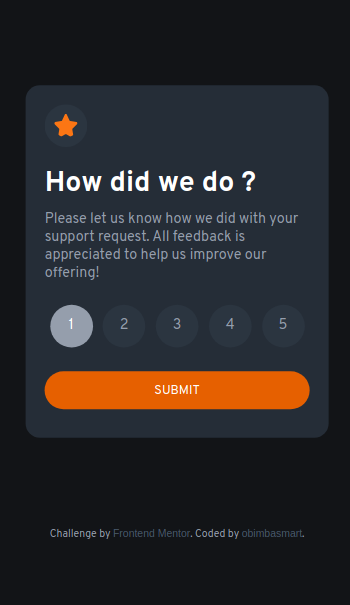
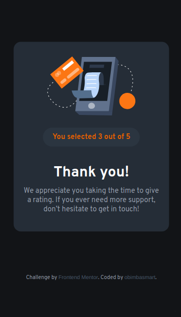

# Frontend Mentor - Interactive rating component solution

This is a solution to the [Interactive rating component challenge on Frontend Mentor](https://www.frontendmentor.io/challenges/interactive-rating-component-koxpeBUmI)
## The challenge

Users should be able to:

- View the optimal layout for the app depending on their device's screen size
- See hover states for all interactive elements on the page
- Select and submit a number rating
- See the "Thank you" card state after submitting a rating

## Solution

    
    

### Links

- Solution URL: [Not available yet]()
- Live Site URL: [Add live site URL here](https://rating-component.w3spaces.com/)

### Built with

- HTML, CSS and JavaScript
- Semantic HTML5 markup
- CSS custom properties
- Flexbox
- Mobile-first workflow

## Key Learning
In this project, I employed JavaScript to infuse interactivity into the webpage through DOM manipulation techniques. It was a delightful experience witnessing the webpage come alive with interactive elements.

Furthermore, I acquired knowledge in utilizing localStorage to store small key-value pairs, enhancing the user's browsing experience.

Additionally, I harnessed the power of CSS and variables to establish a consistent design approach, eliminating the need for repetitive code while maintaining uniformity in colors and sizes throughout the project.

## Useful resources

- [How to put text inside radio button?](https://stackoverflow.com/questions/45259139/how-to-put-text-inside-radio-button) - This helped me in styling the radio buttons to give them specific numbering and good UI

## Author
[Obimba Smart](https://www.github.com/obimbasmart)

